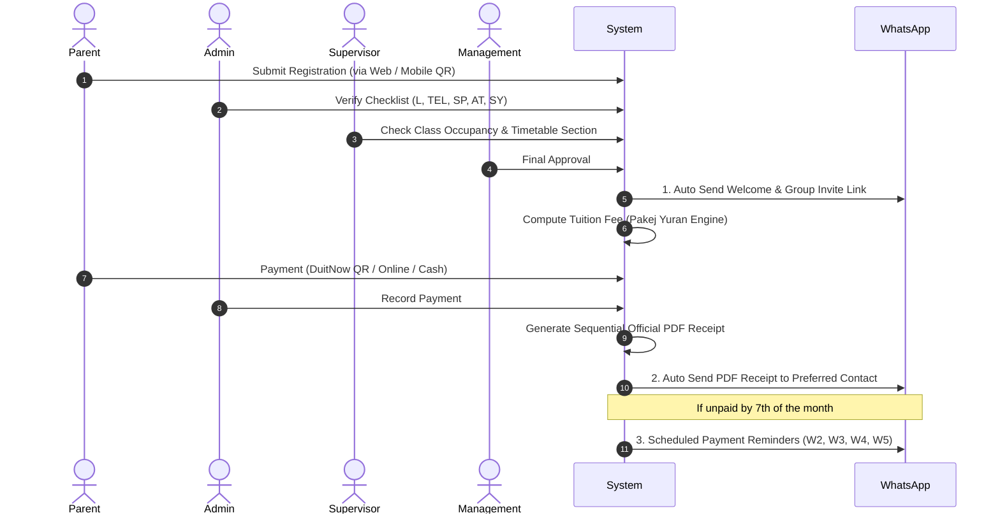

# Pusat Tuisyen An Nur (Telipot) - ERP System Specification & Design Skill

This document is the authoritative master reference and operational skill for the **Pusat Tuisyen An Nur ERP System** (Tingkat 1 & 2, PT 105 Seksyen 23, Jalan Telipot, 15150 Kota Bharu, Kelantan).

It aligns all source requirements, operational documents, forms, financial matrices, and the frontend design system extracted from the Figma prototype.

---

## 1. Locked Frontend Design System (Figma Standard)

All user interfaces must strictly adhere to this visual architecture and token palette:

### A. Color Palette
| Role / Element | Hex Token | CSS / Tailwind Class | Usage |
|---|---|---|---|
| **Brand Primary** | `#4F46E5` (Indigo 600) | `bg-indigo-600`, `text-indigo-600` | Main CTA buttons, active sidebar items, primary headers |
| **Brand Primary Hover** | `#4338CA` (Indigo 700) | `hover:bg-indigo-700` | Button hover and active press states |
| **Brand Accent / Tint** | `#6366F1` (Indigo 500) | `text-indigo-500`, `ring-indigo-500` | Interactive focus rings, link hovers, active pills |
| **Viewport Background** | `#F8FAFC` (Slate 50) | `bg-slate-50` | Primary app canvas background (clean, airy contrast) |
| **Surface Cards** | `#FFFFFF` (White) | `bg-white` | Content containers, form cards, modal dialogues |
| **Card Borders** | `#E2E8F0` (Slate 200) | `border-slate-200` | 1px clean separators and input outlines |
| **Text Primary** | `#0F172A` (Slate 900) | `text-slate-900` | Headings, student names, prominent figures |
| **Text Secondary** | `#475569` (Slate 600) | `text-slate-600` | Field labels, descriptive subtext, table captions |
| **Text Muted** | `#94A3B8` (Slate 400) | `text-slate-400` | Placeholder text, disabled hints, subtle icons |
| **Success / Active** | `#10B981` (Emerald 500) | `bg-emerald-500`, `text-emerald-700` | Active students, paid receipts, open seats, approved status |
| **Warning / Pending** | `#F59E0B` (Amber 500) | `bg-amber-500`, `text-amber-800` | On-hold status, near-full seats, pending supervisor approval |
| **Danger / Overlimit** | `#EF4444` (Rose 500) | `bg-rose-500`, `text-rose-700` | Inactive, overcapacity (`-2 seats`), overdue fees, rejected |
| **WhatsApp Action** | `#25D366` | `bg-[#25D366]` / `text-emerald-600` | 1-click WhatsApp buttons for greeting, receipts, reminders |

### B. Typography & Component Styles
* **Font Family:** Inter, Plus Jakarta Sans, system sans-serif (`font-sans`).
* **Card Container:** `bg-white rounded-2xl border border-slate-200 shadow-sm p-6`.
* **Primary Button:** `px-5 py-2.5 rounded-xl font-semibold text-white bg-indigo-600 hover:bg-indigo-700 transition shadow-sm active:scale-95`.
* **Form Inputs:** `w-full rounded-lg border border-slate-200 px-3.5 py-2 text-slate-800 placeholder-slate-400 focus:border-indigo-500 focus:ring-2 focus:ring-indigo-100 outline-none transition`.
* **Role Quick-Switcher Cards (Figma style):**
  * *Admin Card:* Tinted soft rose/purple (`bg-purple-50 border-purple-200 text-purple-700`).
  * *Staff/Supervisor Card:* Tinted soft blue (`bg-blue-50 border-blue-200 text-blue-700`).
  * *Management Card:* Tinted soft indigo (`bg-indigo-50 border-indigo-200 text-indigo-700`).
* **Micro-Action Buttons:** Inline WhatsApp trigger (`[WS]`), Direct Phone Call (`[Call]`), Direct Email (`[Email]`), and PDF Generator (`[PDF Resit]`).
* **Responsive Architecture:** Desktop operations panel, Tablet classroom attendance layout, and Mobile Parent Self-Registration interface accessible via QR code.

---

## 2. Role-Based Access Control (RBAC) & Authority Matrix

| Function / Module | Admin 1 & 2 (Operations) | Supervisor (Academic) | Management (Directors) | Parent (Public/QR) |
|---|---|---|---|---|
| **Parent Self-Registration** | Assist / Verify | Monitor intake | View statistics | Fill form via QR |
| **Student Registration Approval** | Draft / Submit | Review | **Approve / Reject** | View status |
| **Office Checklist (L, TEL, SP, AT, SY)**| **Mark & Update** | Audit | Oversee | None |
| **Attendance Tracking** | **Daily Marking** | Audit & Alerts | High-level reports | View child attendance |
| **Master Timetable & Class Setup** | View | Draft & Adjust | **Approve Master** | View schedule |
| **Cancellation & Gantian Kelas** | Log requests | **Verify & Reschedule** | Audit impact | Receive WS notice |
| **Teacher Assignment & Substitution**| View assigned | **Dispatch Substitutes**| Approve contracts | None |
| **Teacher Allowance & Payslips** | View hours | Review attendance | **Approve & Sign-off** | None |
| **Student Fee Collection & Receipt** | **Issue & WS PDF** | Audit | Review sales | Receive WS receipt |
| **Payment Vouchers (< RM500)** | **Create & Record** | Review | Audit | None |
| **Payment Vouchers (RM500 - RM3K)** | Draft | **Approve / Reject** | Audit | None |
| **Payment Vouchers (> RM3,000)** | Draft | Endorse | **Approve / Reject** | None |
| **Business Rules & Pricing Config**| None (Read-only) | None (Read-only) | **Full Self-Service** | None |

---

## 3. Management Self-Service Business Configuration Engine (No-Code)

To guarantee that Directors & Finance Approvers can modify business rules without developer involvement, the ERP provides a dedicated **Master Business Configuration Hub**:

### A. Dynamic Subject Catalog Management
* **Subject Creation & Editing:** Add new subjects (e.g. Coding, Arabic, Ekonomi), edit names, or toggle status (`Active` / `Inactive`).
* **Form & Level Mapping:** Assign each subject to target educational levels:
  * `Primary`: Darjah 5, Darjah 6.
  * `Lower Secondary`: Form 1, Form 2, Form 3.
  * `Upper Secondary`: Form 4, Form 5.
* **Streams:** Assign stream compatibility (`Sains`, `Sastera`, or `Teras/General`).

### B. Dynamic Pricing & Package Engine (`Pakej Yuran`)
* **Registration Fee Setting:** Configurable default (Currently `RM 30.00`).
* **Secondary Tiered Rate Formula:** Management can define and update subject thresholds and price-per-subject:
  * Standard Baseline (Default):
    * 4 subjects: `RM 60.00 / subject` = **RM 240.00**
    * 5 subjects: `RM 55.00 / subject` = **RM 275.00**
    * 6 subjects: `RM 55.00 / subject` = **RM 330.00**
    * 7 subjects: `RM 50.00 / subject` = **RM 350.00**
    * 8 subjects: `RM 50.00 / subject` = **RM 400.00**
* **Primary School Fixed Packages:**
  * Darjah 5: Configurable fee (Default `RM 100.00` for 2 subjects).
  * Darjah 6: Configurable fee (Default `RM 200.00` for 4 subjects).
* **Walk-in & Special Case Rates:** Configurable per-session walk-in rate (e.g. `RM 20 - RM 30 / session`) and single-subject exemptions.
* **Discounts & Vouchers:** Ability to create promotional codes, fixed RM deductions, percentage vouchers, and sibling bundle discounts.

### C. Teacher Compensation & Allowance Settings (`Elaun Guru`)
* **Base Session Rates:** Configurable per 1.5-hour session for Permanent vs Replacement teachers.
* **Subject Complexity Multipliers:** Option to set higher compensation for specialized subjects (e.g. Add Math, Fizik, Kimia).
* **Yearly Increment Rules:** Configurable annual percentage increment or flat rate adjustments.
* **Permit & Contract Alerts:** Configurable notification window (e.g., 30 days before teaching permit expiration).

### D. Classroom Capacity & Operational Rules
* **Class Seat Limits:** Set default class maximum capacity (Default `20` or `25` students).
* **Overcapacity Tolerance:** Define warning thresholds when a class reaches 100% capacity or negative seats (e.g. `-2`).
* **Payment Deadlines & Termination Cutoffs:**
  * Monthly fee due date (Default: `Before 7th of every month`).
  * Unpaid suspension rule (Default: `2 months consecutive arrears without notification = auto-suspend`).
  * Class withdrawal notice period (Default: `2 weeks prior notification`).
* **Approval Thresholds:** Edit Payment Voucher limit bands (Default: Tier 1 `< RM500`, Tier 2 `RM500 - RM3,000`, Tier 3 `> RM3,000`).

---

## 4. Operational Alignment of All Source Documents

### A. Borang Pendaftaran (Student Intake & Parent Contract)
* **Student Record Fields:**
  * Photo upload, Full Name, MyKAD / IC Number, Residential Address.
  * Contact Info: Mobile Phone (with instant WhatsApp & Call triggers), Home Phone, Email.
  * School Profile: School Name, School Code, Category, Current Level (Form 1–5 / Darjah 5–6), Stream (`Sains` / `Sastera`).
* **Parents / Guardians (Dual Parent Capture):**
  * Father Name, Phone, Occupation.
  * Mother Name, Phone, Occupation.
  * **"Preferred Contact" Toggle:** Designates which parent receives official WhatsApp receipts and reminders.
* **Office Processing Checklist (Mandatory 5-Point Validation):**
  * `[L]` **Ledger:** Account ledger code created.
  * `[TEL]` **WhatsApp:** Added to official broadcast group and parent directory.
  * `[SP]` **Senarai Pelajar:** Added to master student roster.
  * `[AT]` **Kedatangan:** Attendance register initialized.
  * `[SY]` **Sistem Pembayaran:** Billing cycle and monthly subscription activated.
* **Academic Consent & Parent Contract:**
  * `SAPS NKRA MOE`: Student declaration authorizing exam score verification (`sapsnkra.moe`).
  * 6 Enforced Parent Clauses: Payment before 7th; 2 months unpaid auto-termination; 2 weeks advance termination notice; clear outstanding arrears; student absence disclaimer; classroom accident disclaimer.

### B. Master Timetable 2026 (`Jadual Master 2026`)
* **Time Slots (1 Hour 30 Minutes Per Session):**
  * *Friday (Jumaat) & Saturday (Sabtu) Sessions:*
    * Slot 1: 9:00 AM – 10:30 AM
    * Slot 2: 10:40 AM – 12:10 PM (Sabtu: 10:45 AM – 12:15 PM)
    * Slot 3: 12:30 PM – 2:00 PM (Sabtu)
    * Slot 4: 2:15 PM – 3:45 PM (Sabtu) / 3:00 PM – 4:30 PM (Jumaat)
    * Slot 5: 4:00 PM – 5:30 PM (Sabtu) / 4:45 PM – 6:15 PM (Jumaat)
  * *Night Sessions (Monday to Thursday / Isnin – Khamis):*
    * Slot: 8:30 PM – 10:00 PM
  * *Sunday (Ahad):* Rest Day / Administrative Maintenance.
* **Section Allocation:** Subjects are subdivided into tracks (e.g. `F5 ADDMT (A)`, `F5 BI (B)`, `F5 SEJ (C)`, `F5 SNS (A)`, `F5 KIM (B)`) to balance student volume.
* **Real-time Seat Indicator:** During registration, available seats are dynamically shown (e.g. `18/20`). If capacity is exceeded, display negative seat counts (e.g. `-2`) and trigger waiting list mode.

### C. Class Rescheduling & Replacement Log (`Catatan Pembatalan dan Gantian`)
* **Core Audit Log Fields:**
  * `Month`: (e.g., Dec '25, Jan '26).
  * `Subject & Form`: (e.g., F5 Math A, F5 Bio B, F4 Sej A).
  * `Tarikh Batal`: Original scheduled date cancelled.
  * `Tarikh Ganti`: Designated replacement session date.
  * `Extra Class`: Flag for supplementary intensive sessions.
  * `Remarks`: Mandatory documented reason (e.g., Public Holiday / Krismas, Teacher marking SPM papers, Time clash correction).
* **Automated Notification:** When a replacement class is finalized by the Supervisor, an automated WhatsApp schedule update is dispatched to enrolled students/parents.

### D. Teacher Roster & Allowance (`Elaun Guru 2026`)
* **Two Teacher Tiers:**
  * **Cikgu Permanent:** Regular core faculty with fixed yearly assignments.
  * **Cikgu Ganti Aktif:** Standby replacement faculty mobilized for coverage.
* **Initials & Subject Mapping (2026 Roster):**
  * `NAK`: Nik Ahmad Khan (Fizik F5/F4)
  * `Z`: Zakir (Bahasa Inggeris F5/F3) / Zamri (Add Math, Bio, Sains)
  * `M`: Maheran / Nik Nas (Sejarah F3–F5)
  * `AT`: Atiqah / Azimah (Prinsip Perakaunan F4/F5)
  * `AM`: Amin (Biologi, Sains F2–F5)
  * `SF`: Saiful (Kimia, Matematik F2–F5)
  * `HS`: Hasmini (Sains Std 5/6)
  * `AZ`: Azahari (Sains F2/F3) / Azizawati (Add Math)
  * `HK`: Hakimi (Matematik F4/F5)
  * `SAF`: Safran (Matematik F2–F5)
  * `D`: Diana (Biologi F4/F5)
  * `FQ`: Faqihah (Matematik Std 5/6)
  * `K`: Kamal (Bahasa Melayu F2/F3, Std 5/6)
  * `G`: Ghazani (Bahasa Melayu F2–F5)
* **Payroll Automation:** Hourly allowances automatically accrue from verified attendance records. System compiles PDF payslips and dispatches them via WhatsApp upon management approval.

---

## 5. End-to-End Billing & WhatsApp Automation Cycle

---

## 6. Expenses & Multi-Tier Payment Voucher (PV) Workflow
* **Auto-generated Reference:** `PVYY-MM##` (e.g. `PV26-0301`).
* **Approval Tiers:**
  * `< RM 500`: Verified and signed by Admin 1 or Admin 2.
  * `RM 500 – RM 3,000`: Requires digital endorsement by Supervisor.
  * `> RM 3,000`: Requires digital sign-off by Management (Directors).
* **Vendor Directory:** Stores Vendor Name, Tax Identification Number (TIN), Bank Account, PIC, and procurement history.

---

## 7. Operational Standards & Verification Rules
1. **Never hardcode pricing or subject lists in frontend templates**; always consume from the Management Dynamic Configuration API.
2. **Never allow editing of approved financial or registration records** without an elevated Supervisor/Management change-request approval.
3. **Always display real-time class capacity**; alert front-desk staff immediately if a subject selection results in overcapacity.
4. **Preserve audit trails** for every add/drop subject, class cancellation, and fee waiver.
